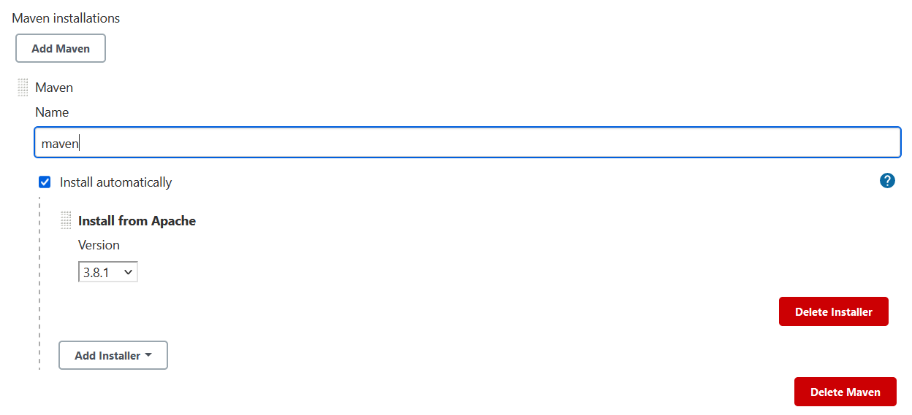

# Simple jenkins pipeline with custom security inspections of docker images

## Prerequisites
* [Docker/Docker-Compose](https://www.docker.com/)

---

## Steps

---

### Running Jenkins:
Execute the following commands:
```
$ docker image build -t jenkins-docker -f Dockerfile.jenkins .
$ docker container run -d -p 8080:8080 -v /var/run/docker.sock:/var/run/docker.sock jenkins-docker
```
After this, you will have a local Jenkins server running, we just have to configure it now.

---

### Configuring Jenkins:
Accessing Jenkins on localhost:8080, you will be requested to unlock Jenkins with administrator password.
The password can be obtained by executing the following command:
```
$ docker exec -it <container name> cat /var/jenkins_home/secrets/initialAdminPassword
```
Further, select 'install suggested plugins', and the Jenkins will download automatically the basic plugins.

The pipeline uses an extra plugin that needs to be installed manually.
From the Dashboard go to > Manage Jenkins > Manage Plugins and install the 'docker pipeline'


---

### Jenkins Global Configurations:
Configure the JDK and Maven in global configurations.

From the Dashboard go to > Manage Jenkins > Global Tool Configuration

The jenkins container already comes with an embedded open jdk, and the JDK directory will be located in /usr/lib/jvm/java-8-openjdk-amd64.
Add the **JDK** like this:


For **maven** download and install de most recent version, like the image bellow:


---

### Creating the pipeline:
From the dashboard, just click on 'New Item', enter a name, select Pipeline and click 'Ok'.


Next, in the Pipeline tab, let's create the pipeline from our this git repository, like is showed next:


---

#### Run the pipeline
Just click on 'Build Now' and verify the results.


---

## Acknowledgments
The script that do the security inspections was heavily inspired on code made by https://github.com/docker/docker-bench-security
